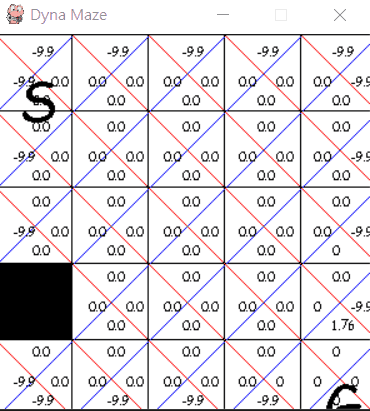

# Q-learning-visualization

This is a modified version of  [Dyna-Q](https://github.com/konantian/Dyna-Maze-Game)

I change a littel bit code to show action value in the map.

## install
>pip install -r requirements.txt

## run
> python expMaze.py